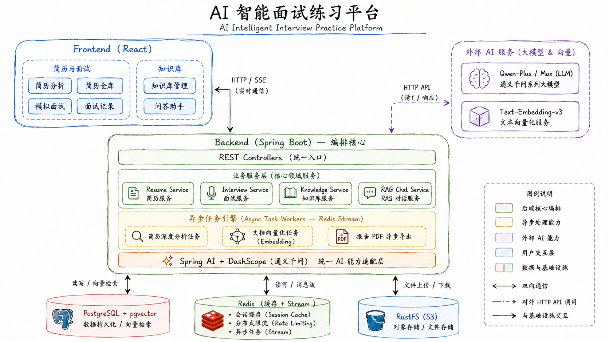
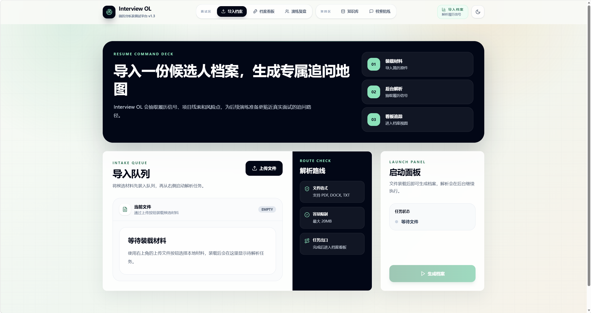
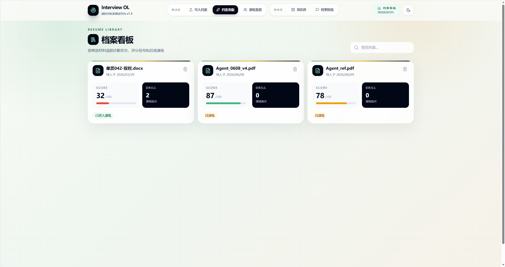
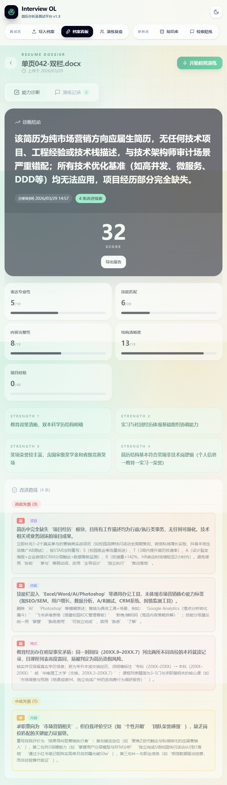
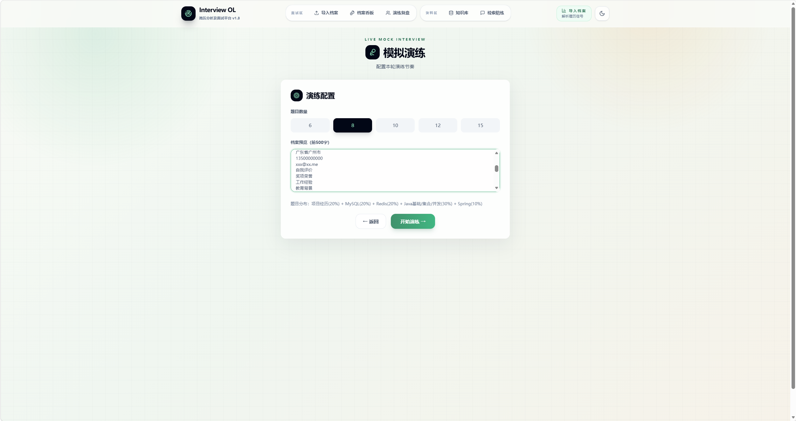
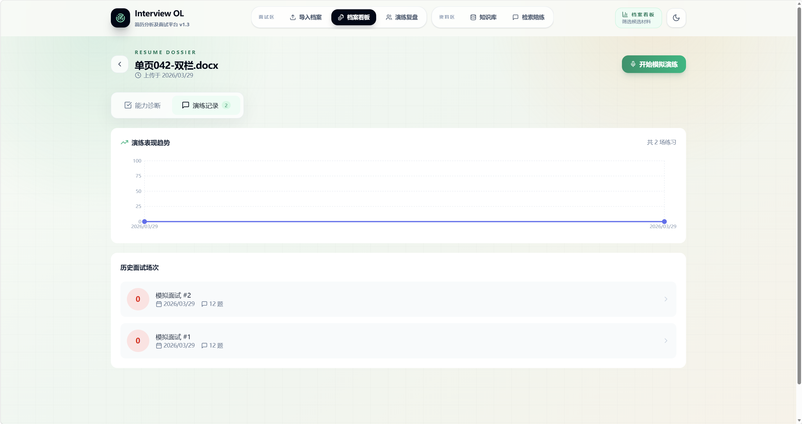
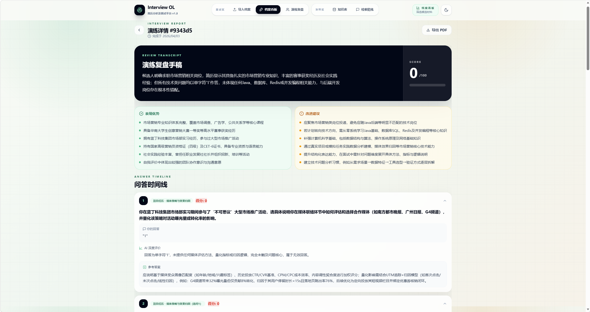
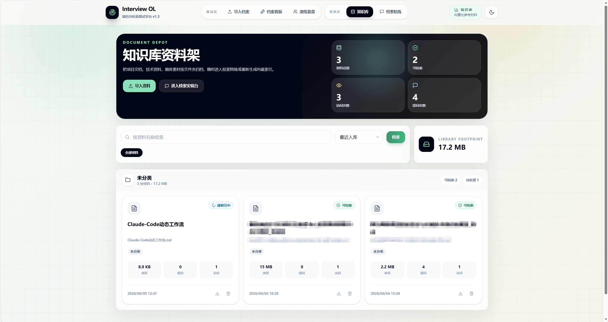
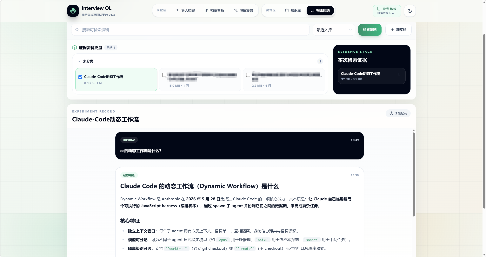

<div align="center">

**AI 智能面试练习平台** — 基于 LLM + RAG 的简历分析与模拟面试系统

[](https://openjdk.org/)
[](https://spring.io/projects/spring-boot)
[](https://spring.io/projects/spring-ai)
[](https://react.dev/)
[](https://www.postgresql.org/)
[](https://redis.io/)

</div>

---

## 项目介绍

面向技术求职者的智能面试练习平台。上传简历后，AI 自动解析技术栈并生成个性化面试题；作答过程中实时追踪表现，结束后产出多维度评估报告。同时内置基于 pgvector 的 RAG 知识库，支持上传技术文档进行检索增强问答。

后端采用 Java 21 + Spring Boot 4.0，通过 Redis Stream 异步架构将 LLM 调用、文档向量化等重 I/O 任务解耦，核心接口响应控制在 200ms 内。

## 系统架构



**请求链路**：React → Spring Boot → Redis Stream（异步任务）→ Spring AI（LLM 调用）→ PostgreSQL + pgvector

**异步处理流程**：

```
请求到达 → 校验入库 → 推送 Stream → 立即返回（< 200ms）
                          ↓
                  Consumer 消费消息
                          ↓
                LLM 调用 / 向量化任务
                          ↓
                  更新数据库状态
                          ↓
               前端轮询获取最新结果
```

状态流转：`PENDING` → `PROCESSING` → `COMPLETED` / `FAILED`（失败自动重试最多 3 次）

## 功能展示

### 首页 & 简历上传

上传 PDF / DOCX / TXT 格式简历，系统自动提取内容并创建分析任务。



### 档案看板

以卡片墙形式展示所有已上传的简历及其分析状态（待分析 / 分析中 / 已完成 / 失败），支持按名称搜索和状态筛选。



### 简历分析详情

AI 从项目技术深度（40 分）、技能匹配度（20 分）、内容完整性（15 分）、结构清晰度（15 分）、表达专业性（10 分）五个维度对简历进行量化评分。同时给出项目描述的 STAR 重写建议、技术名词规范纠错和方案优化建议。支持一键导出 PDF 分析报告。



### 模拟面试

选择已分析的简历、设置题目数量后，AI 根据简历中的技术栈生成个性化面试题。题目遵循"基础 30% + 进阶 50% + 专家 20%"的难度梯度，每道题自动附带追问。支持逐题作答、暂存草稿、提前交卷。



### 演练复盘

汇总所有模拟面试记录，展示每场演练的得分趋势、问答详情和批量评估结果。支持按状态（已评估 / 进行中）筛选，点击可查看完整复盘报告。



### 面试详情

展示当日模拟面试的完整问答记录，包含每道题的得分、AI 评语和多维度综合评估。得分通过进度条和雷达图可视化呈现。



### 知识库管理

支持上传 PDF / DOCX / Markdown 文档，自动分块并异步向量化存入 pgvector。文档卡片展示向量化状态、问答次数统计，支持下载和删除。



### AI 检索问答

基于 RAG 的流式问答助手。选择知识库后提问，系统自动执行 Query Rewrite 补全语义、向量检索匹配相关文档片段，最后由 LLM 结合上下文生成回答，通过 SSE 流式返回。



## 技术亮点

### 后端

| 亮点 | 说明 |
|------|------|
| **Redis Stream 异步消费** | 抽象 `AbstractStreamConsumer/Producer` 模板基类（Template Method），统一消费循环、ACK、3 次自动重试、优雅停机。子类仅需实现 12 个钩子方法 |
| **分布式限流** | Redis + Lua 滑动时间窗口，`@RateLimit` 注解 + AOP 无侵入接入，GLOBAL/IP/USER 三维度组合，Hash Tag 兼容 Cluster，支持 Fallback 降级 |
| **会话缓存与状态机** | CREATED → IN_PROGRESS → COMPLETED → EVALUATED 四态流转，Cache-Aside 模式（Redis 热数据 + PostgreSQL 全量），缓存未命中自动回源 |
| **Java 21 虚拟线程** | 一行配置启用，SSE 长连接与大批量 LLM 并发调用场景下显著提升吞吐 |

### Agent 工程

| 亮点 | 说明 |
|------|------|
| **双角色 Prompt 体系** | "面试官出题"与"评估官打分"拆分为独立 System Prompt，配合难度梯度与输出格式约束保证生成质量 |
| **结构化输出定向修复** | `StructuredOutputInvoker` 解析失败时将错误原因回注 prompt，实现定向修复而非盲目重试，成功率 85% → 98% |
| **动态分批评估** | 每 8 题一批独立评估后二次汇总，规避长上下文 Token 溢出，确保评估稳定性 |
| **SSE 探测窗口** | 缓冲前 120 字符检测"无信息"模式，命中立即截断 → 避免 LLM 输出长篇无效回复 |

### RAG 系统

| 亮点 | 说明 |
|------|------|
| **自适应检索参数** | 根据查询长度动态调整 topK（8/12/20）与相似度阈值（0.18/0.28） |
| **Query Rewrite** | LLM 自动将短查询补全为更可检索的完整语义句 |
| **短 Token 二次确认** | 对"Redis""Java"等短关键词，额外验证文档是否真正包含该词，过滤伪命中，准确率提升 35%+ |

## 技术栈

**后端**：Java 21 · Spring Boot 4.0 · Spring AI 2.0 · PostgreSQL + pgvector (HNSW) · Redis 7 (Stream + 缓存) · Apache Tika · iText 8 · Gradle

**前端**：React 18 · TypeScript · Vite · Tailwind CSS 4 · Framer Motion · Recharts · Lucide Icons

**AI**：阿里云 DashScope (qwen-plus) · text-embedding-v3 · OpenAI 兼容协议

## 项目结构

```
interview-guide/
├── app/src/main/java/interview/guide/
│   ├── App.java                        # 启动入口
│   ├── common/
│   │   ├── async/                      # Redis Stream 消费/生产模板
│   │   ├── annotation/                 # @RateLimit 注解
│   │   ├── aspect/                     # RateLimitAspect 切面
│   │   ├── config/                     # 应用配置
│   │   ├── exception/                  # 全局异常处理 + 错误码
│   │   └── result/                     # 统一响应体
│   ├── infrastructure/
│   │   ├── export/                     # PDF 报告导出
│   │   ├── file/                       # 文件解析与存储
│   │   ├── redis/                      # Redis 服务封装
│   │   └── storage/                    # S3 对象存储
│   └── modules/
│       ├── interview/                  # 面试模块（会话、评估、报告）
│       ├── knowledgebase/              # 知识库模块（向量化、RAG 问答）
│       └── resume/                     # 简历模块（上传、分析、导出）
├── app/src/main/resources/
│   ├── application.yml                 # 应用配置
│   ├── prompts/                        # 7 套 Prompt 模板
│   └── scripts/rate_limit.lua          # 限流 Lua 脚本
├── frontend/src/
│   ├── api/                            # Axios 接口封装
│   ├── components/                     # 通用组件
│   ├── pages/                          # 8 个页面组件
│   └── App.tsx                         # 路由配置
├── docker-compose.yml                  # 6 服务编排
└── app/Dockerfile                      # 多阶段构建
```

## 开源协议

AGPL-3.0 License

---

*Built with Java 21, Spring AI 2.0 & React 18*
